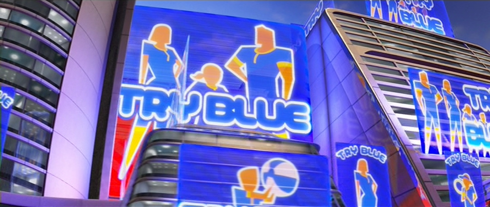

#Meteor Ride (the Visual Studio edition)
####A *Real-time IDE* (R-IDE) for Meteor

#on:

--------------------------------------------------------

Meteor Ride (Visual Studio edition) is an extension for Visual Studio 
with the goal of being the being the best development platform for developing
web and mobile apps on the [Meteor Platform](http://meteor.com).

## What's so great about Meteor?
Seems like every 5 minutes there's some glossy new web framework being promoted with 
some new trick up it's sleve, but it's always just interesting ways to do the same old 
"stupid web tricks" everyones been doing since the. turn. of. the. century. They can 
dress it up with a new sound system and spining rims but this **is** 
your fathers oldsmo-buick web (like, literally).

Meteor is an actually-different full-stack packaging 
framework for building the next generation of web and mobile applications.

Here are just a few of the reasons why we think Meteor represents an 
*"extinction-level event"* for all the other *dinosaur* web frameworks.

* ####One Development Language
Question: Should this code run on the server or the client? 
Answer: It depends.
Solution: Meteor packages up your logic to run in either and choses which is better at run-time.

* ####One Package System
The packaging situation is a mess. You have to pick a package manager for server code, 
then pick a different one for client code, and then pick yet another one for your 
build/lint/minify/tool. Oh, and none of them are integrated at all and they're all 
overlapping and competing with each other.

 
Unified smart package system that allows a single package to include both
server and client code with hooks for build-time and run-time components.

* All web-sockets, all the time.
  XHR came out in 2001 and most frameworks are still primarily focused on 

* Boom goes the dynomite.

The bottom line is if you are building something using anything else you are 
going to get way less accomplished and have much less fun in the process.

## What is Visual Studio?

## What we mean by "*real-time IDE*"?

## Who is Brian Jimdar? What is "Vectria?"
Hi I'm Brian and I run a dev shop in Seattle called Vectria.

The name Vectria is sposed to be like "vector + ria" where a 
"RIA" stands for "Rich Internet Application". 
Anyway... we build cool stuff.

